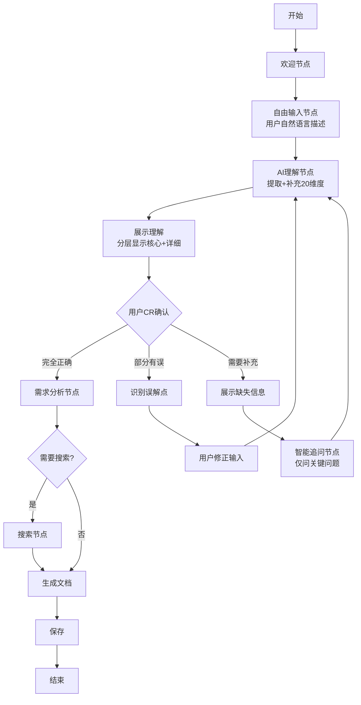

# AI 理解确认式交互升级计划（激进重构版）

## 核心改进目标

**激进重构**当前的4问题固定流程，实现全新交互模式：

**用户自由描述** → **AI智能理解补充20+维度** → **分层展示给用户CR** → **针对性追问** → **生成文档**

**关键决策**：
- 采用路径1（激进重构），一次性实现所有功能
- 移除 app.py（Streamlit）和所有 Web 相关代码
- 专注优化 CLI 交互体验
- 目标：5分钟内完成，但信息收集深度提升5倍

## 当前系统不足总结

### 信息收集维度对比

| 维度类别 | 当前系统                   | 新模板要求                                           | 差距                     |
| -------- | -------------------------- | ---------------------------------------------------- | ------------------------ |
| 项目基础 | 项目类型、团队规模、时间线 | 项目类型细分、项目阶段、已有技术栈、团队规模、时间线 | 缺少项目阶段和已有技术栈 |
| 业务场景 | 特殊需求（自由文本）       | 核心功能、页面量级、目标用户、业务约束               | 缺少4个详细维度          |
| 性能要求 | 包含在特殊需求中           | 性能红线、SSR/SEO、极致体验要求                      | 无量化指标               |
| 工程约束 | 仅团队规模                 | 技术熟悉度、版权费用、工程化、维护成本               | 缺少4个维度              |
| 兼容环境 | 无                         | 浏览器版本、跨端需求、宿主环境                       | 完全缺失                 |
| 决策偏好 | 无                         | 优先级排序（1-6）、禁忌项                            | 完全缺失                 |

**总计**：当前收集 4 项 → 新模板要求 20+ 项

### 核心问题

1. **信息不足导致推荐不准确**
   - 不知道是新建还是改造项目（技术选择完全不同）
   - 不知道用户优先级（性能 vs 开发速度）
   - 缺少量化指标（无法判断"高性能"具体是多少）

2. **无法处理复杂场景**
   - 老项目改造无法评估兼容性成本
   - 跨端需求无法给出统一方案
   - 特定行业（金融/医疗）的合规要求无法识别

3. **用户体验不够友好**
   - 固定4个问题，缺乏灵活性
   - 问题粒度粗，用户不知道该说什么
   - 没有确认环节，错误无法纠正

## 新架构设计

### 工作流改造



### 状态 Schema 扩展

在 `[src/agent/state.py](src/agent/state.py)` 中新增字段：

```python
class TechStackState(TypedDict):
    # ===== 新增：用户输入相关 =====
    raw_user_input: str                    # 用户原始自由文本输入
    ai_understanding: Dict[str, Any]       # AI理解的完整结构（20+维度）
    confidence_score: float                # AI理解的置信度 (0.0-1.0)

    # ===== 新增：确认和修正 =====
    confirmed: bool                        # 用户是否确认理解正确
    correction_rounds: int                 # 修正轮次
    missing_info: List[str]                # 缺失的关键信息

    # ===== 原有字段保留 =====
    project_type: str
    team_size: str
    timeline: str
    special_requirements: str

    # ===== 新增：详细项目信息 =====
    project_stage: str                     # 新建/改造/替换
    existing_tech_stack: Dict[str, str]   # 已有技术栈（如改造项目）
    core_features: List[str]              # 核心功能列表
    target_users: str                     # 目标用户群体
    page_scale: str                       # 页面量级

    # ===== 新增：性能要求 =====
    performance_metrics: Dict[str, Any]   # 性能红线（可量化）
    seo_requirement: str                  # SEO/SSR需求
    ux_requirements: List[str]            # 极致体验要求

    # ===== 新增：工程约束 =====
    team_tech_familiarity: Dict[str, str] # 团队技术熟悉度
    budget_constraints: str               # 预算约束
    engineering_requirements: List[str]   # 工程化要求（TS/测试等）

    # ===== 新增：兼容性 =====
    browser_compatibility: List[str]      # 浏览器兼容范围
    cross_platform: Dict[str, Any]        # 跨端需求

    # ===== 新增：决策偏好 =====
    priority_ranking: List[str]           # 优先级排序（性能/速度/成本等）
    forbidden_items: List[str]            # 绝对禁忌项

    # ... 其他现有字段 ...
```

## 激进重构实施计划

### 采用方案：路径1（激进重构）

**原因**：
1. 项目处于 Demo 阶段，可以大胆重构
2. 一次性实现完整功能，避免技术债务
3. 用户要求移除 Web 界面，正好简化范围

### 需要移除的文件

**Web 相关文件**（直接删除）：
- `[app.py](app.py)` - Streamlit Web 界面
- `requirements.txt` 中的 `streamlit>=1.30.0` 依赖

**保留文件**：
- `[cli.py](cli.py)` - CLI 入口（需重构）
- 所有 `src/` 下的核心模块（需大幅修改）

### 完整实施步骤（激进重构）

#### 步骤 1：清理和准备（30分钟）

**删除文件**：
- 删除 `[app.py](app.py)`
- 更新 `[requirements.txt](requirements.txt)` 移除 streamlit

**备份**：
- 创建 `backup/` 目录备份现有关键文件
- 保留当前 nodes.py 作为参考

#### 步骤 2：重构状态定义（1小时）

**文件**：`[src/agent/state.py](src/agent/state.py)`

**新增字段**（完整20+维度）：

```python
class TechStackState(TypedDict):
    # ===== 用户输入 =====
    raw_user_input: str                    # 用户原始自然语言输入
    
    # ===== AI理解结果 =====
    ai_understanding: Dict[str, Any]       # 完整的20+维度结构化理解
    confidence_score: float                # 整体置信度 (0.0-1.0)
    
    # ===== 确认流程 =====
    confirmed: bool                        # 用户是否确认
    correction_rounds: int                 # 修正轮次
    needs_followup: bool                   # 是否需要追问
    
    # ===== 6大类详细字段 =====
    
    # 1. 项目基础 (5维度)
    project_type_detail: str               # 细分类型（Web-C端/Web-后台等）
    project_stage: str                     # 新建/改造/替换
    existing_tech_stack: Dict[str, str]   # 已有技术栈
    team_size: str
    timeline: str
    
    # 2. 业务场景 (4维度)
    core_features: List[str]              # 核心功能列表
    page_scale: str                       # 页面量级
    target_users: str                     # 目标用户
    business_constraints: List[str]       # 业务约束
    
    # 3. 性能要求 (3维度)
    performance_metrics: Dict[str, Any]   # 性能红线
    seo_requirement: str                  # SEO/SSR需求
    ux_requirements: List[str]            # 极致体验要求
    
    # 4. 工程约束 (4维度)
    team_tech_familiarity: Dict[str, str] # 团队技术熟悉度
    budget_constraints: str               # 预算约束
    engineering_requirements: List[str]   # 工程化要求
    maintenance_cost: str                 # 维护成本要求
    
    # 5. 兼容性 (3维度)
    browser_compatibility: List[str]      # 浏览器兼容
    cross_platform_needs: Dict[str, Any]  # 跨端需求
    host_environment: str                 # 宿主环境
    
    # 6. 决策偏好 (2维度)
    priority_ranking: List[str]           # 优先级排序
    forbidden_items: List[str]            # 禁忌项
    
    # ===== 原有字段（兼容性） =====
    project_type: str                     # 简化版项目类型
    special_requirements: str             # 从raw_user_input提取
    
    # ===== 后续流程 =====
    extracted_requirements: List[str]
    tech_constraints: List[str]
    needs_search: bool
    search_results: Annotated[List[Dict[str, Any]], operator.add]
    recommended_stack: Dict[str, Any]
    final_document: str
    current_step: str
    messages: Annotated[List[str], operator.add]
    output_path: str
```

#### 步骤 3：创建理解提示词（2小时）

**新文件**：`[src/prompts/understanding.py](src/prompts/understanding.py)`

实现完整的 AI 理解提示词，包含：
1. 6大类20+维度的提取规则
2. 信息来源标记（明确/推测/缺失）
3. 推测置信度评估
4. 优先级推测规则
5. 冲突检测规则

#### 步骤 4：实现新节点（3-4小时）

**文件**：`[src/agent/nodes.py](src/agent/nodes.py)`

**删除旧节点**：
- `ask_project_type_node`
- `ask_team_size_node`
- `ask_timeline_node`
- `ask_special_requirements_node`

**新增节点**：
1. `free_input_node` - 自由输入（替代4个问题）
2. `ai_understand_node` - AI 理解和补充（核心）
3. `show_understanding_node` - 分层展示（核心信息+推测+缺失+完整详情）
4. `user_confirm_node` - 确认流程（4个选项）
5. `identify_corrections_node` - 识别需要修正的点
6. `smart_followup_node` - 智能追问（3-5个关键问题）
7. `apply_corrections_node` - 应用用户修正

保留并适配：
- `welcome_node`（增加新流程说明）
- `analyze_node`（适配新状态）
- `search_node`（保持不变）
- `generate_node`（适配新状态，增加优先级分析章节）
- `save_node`（保持不变）

#### 步骤 5：重构工作流（1-2小时）

**文件**：`[src/agent/graph.py](src/agent/graph.py)`

**新工作流**：

```python
workflow.set_entry_point("welcome")

# 主流程
workflow.add_edge("welcome", "free_input")
workflow.add_edge("free_input", "ai_understand")
workflow.add_edge("ai_understand", "show_understanding")
workflow.add_edge("show_understanding", "user_confirm")

# 确认分支
workflow.add_conditional_edges(
    "user_confirm",
    decide_next_after_confirm,
    {
        "continue": "analyze",           # 确认无误
        "correct": "identify_corrections", # 需要修正
        "followup": "smart_followup",     # 需要补充
        "show_detail": "show_full_detail" # 查看详情
    }
)

# 修正循环
workflow.add_edge("identify_corrections", "apply_corrections")
workflow.add_edge("apply_corrections", "ai_understand")

# 追问循环
workflow.add_edge("smart_followup", "ai_understand")

# 详情展示后返回确认
workflow.add_edge("show_full_detail", "user_confirm")

# 后续流程（保持不变）
workflow.add_conditional_edges("analyze", should_search, {...})
workflow.add_edge("search", "generate")
workflow.add_edge("generate", "save")
workflow.add_edge("save", END)
```

#### 步骤 6：优化 CLI 展示（1-2小时）

**文件**：`[src/utils/display.py](src/utils/display.py)`（新建）

创建专门的 CLI 展示工具类：

```python
class UnderstandingDisplay:
    """专门用于展示AI理解结果的CLI工具"""
    
    def show_tiered_summary(self, understanding: dict):
        """分层展示：摘要 → 推测 → 详情 → 缺失"""
        
    def show_full_details(self, understanding: dict):
        """展示完整20+维度"""
        
    def show_comparison_table(self, field_name: str, data: dict):
        """展示对比表格（如优先级排序）"""
        
    def highlight_conflicts(self, conflicts: list):
        """高亮显示冲突信息"""
```

#### 步骤 7：实现辅助功能（2小时）

**文件**：`[src/utils/validation.py](src/utils/validation.py)`（新建）

```python
def detect_missing_critical_info(understanding: dict) -> List[dict]:
    """检测20+维度中缺失的关键信息"""
    
def detect_information_conflicts(understanding: dict) -> List[dict]:
    """检测信息冲突（如优先级矛盾）"""
    
def calculate_confidence_score(understanding: dict) -> float:
    """计算整体理解置信度"""
    
def prioritize_followup_questions(missing: list, conflicts: list) -> list:
    """对追问问题排序，只问最关键的3-5个"""
```

#### 步骤 8：更新文档生成（1小时）

**文件**：`[src/prompts/generator.py](src/prompts/generator.py)`

在生成的技术文档中增加新章节：

```markdown
## 0. 决策优先级分析（新增）

基于您的项目描述，推测的技术选型优先级：

1. 性能（最高优先级）
   - 依据：您明确提到"最重要的是性能"
   - 影响：优先推荐高性能方案

2. 开发效率（次优先）
   - 依据：1个月时间线较紧
   - 影响：推荐成熟度高的方案

...
```

#### 步骤 9：测试和优化（2-3小时）

**测试场景**：
1. 极简输入（"我要做一个网站"）
2. 详细输入（包含大部分信息）
3. 改造项目输入（需要兼容现有技术栈）
4. 冲突输入（性能优先但时间紧）

**优化重点**：
- AI 理解准确性
- 追问问题的精准性
- CLI 展示的可读性
- 错误处理和降级策略

#### 步骤 10：清理 Web 相关代码（1小时）

**删除文件**：
- `[app.py](app.py)` - Streamlit Web 界面（4,262 bytes）

**更新文件**：
- `[requirements.txt](requirements.txt)` - 移除 `streamlit>=1.30.0` 依赖
- `[README.md](README.md)` - 删除所有 Streamlit 相关章节：
  - "运行 Streamlit Web 界面"章节
  - Streamlit 相关的使用示例
  - app.py 的项目结构说明
- `[USAGE.md](USAGE.md)` - 移除 Web 界面相关内容
- `[.gitignore](.gitignore)` - 移除 `.streamlit/` 忽略规则（可选）

**验证清理**：
- 确保代码中无任何 Streamlit 导入
- 确保文档中无任何 Web 界面相关描述
- 运行 `py cli.py` 验证功能正常

## 关键技术实现细节

### AI 理解提示词（核心中的核心）

完整实现6大类20+维度的信息提取：

**提示词结构**：
1. 系统角色定义（资深架构师）
2. 6大类维度的详细说明（你提供的模板）
3. 推测规则（基于关键词、上下文、行业惯例）
4. 输出格式（结构化JSON，每个字段包含 value/source/reasoning）
5. 置信度评估标准

**推测规则示例**：
- 如果提到"类似Pinterest/小红书" → 推测为C端+需要SEO
- 如果是"后台管理系统" → 推测不需要SEO
- 如果是"1个月内" → 推测开发效率优先级高
- 如果是"大型团队" → 推测需要工程化和可维护性

### 分层展示设计

**第1层**：核心摘要（必看）
- 项目一句话概括
- 项目阶段
- 核心优先级（Top 3）
- AI 置信度

**第2层**：关键推测（重点确认）
- 列出所有"推测"类型的关键信息
- 显示推测依据
- 用 ⚠️ 标记需要特别注意

**第3层**：缺失信息（建议补充）
- 列出建议追问的问题
- 说明为什么这些信息重要

**第4层**：完整详情（可选展开）
- 用表格展示20+维度的完整理解
- 区分明确/推测/缺失
- 显示每个维度的置信度

### 智能追问机制

**触发规则**（优先级排序）：

1. **Critical（必问）**：
   - 改造项目缺少已有技术栈
   - 置信度 < 0.5
   - 关键业务约束缺失

2. **Important（重要）**：
   - 性能优先但无量化指标
   - 跨端需求但未明确具体端
   - 大型团队但无工程化要求

3. **Nice-to-have（可选）**：
   - 预算范围未明确
   - 浏览器兼容要求未说明

**追问限制**：最多5个问题，避免用户疲劳

### 用户确认流程

**4个选项**：
1. 理解正确，继续生成
2. 有误解，我来修正（展开详情，让用户指出错误点）
3. 补充关键信息（回答AI提出的缺失问题）
4. 查看完整详情（展示20+维度表格）

**修正流程**：
- 用户选择"有误解" → 展示完整详情 → 用户输入修正（如"项目阶段是改造，不是新建"）→ AI重新理解 → 再次展示

**追问流程**：
- 用户选择"补充信息" → 展示3-5个关键问题 → 用户回答 → AI整合答案 → 再次展示

## 预期成果

### 交互示例

```
欢迎使用前端技术栈选型 Agent

请用自然语言描述你的项目（你可以简短也可以详细）：

提示：你可以包含任何信息，例如：
  • 项目是做什么的？新建还是改造？
  • 团队规模、开发时间、核心功能
  • 性能要求、特殊需求、最关心的点

> 我要做一个瀑布流图片网站，类似Pinterest，需要无限滚动。
  我一个人开发，希望1个月内做出来。最重要的是性能要好。

AI 正在理解你的需求...

╭─────────────────────────────────────╮
│ AI 理解的需求总结（请确认）          │
│ 置信度：78%                          │
╰─────────────────────────────────────╯

[核心信息]
✓ 项目：瀑布流图片展示网站（类似Pinterest）
✓ 阶段：新建项目
✓ 核心功能：瀑布流布局、无限滚动、图片懒加载
✓ 团队：1人
✓ 时间：1个月
✓ 优先级：性能 > 开发效率 > 成本

[关键推测]（请重点确认）
⚠️ 项目类型：Web端-C端页面
   依据：Pinterest是面向普通用户的C端产品
   
⚠️ 性能指标：首屏<2秒，滚动≥50FPS
   依据：瀑布流应用的行业标准
   
⚠️ 需要SEO：推测需要搜索引擎优化
   依据：C端产品通常需要SEO获取流量

[建议补充]
? 是否需要支持移动端？
? 图片来源方式（用户上传/API）？
? 是否有预算/服务器资源？

请选择：
1. 理解正确，继续
2. 有误解，修正
3. 补充信息
4. 查看完整详情（20+维度）

> 1

继续生成技术文档...
```

### 生成的文档将包含

**新增章节**（在现有10个章节基础上）：

```markdown
## 0. 需求理解与决策依据

### 0.1 项目概况
- 项目类型：Web端-C端页面
- 项目阶段：新建项目
- 核心功能：瀑布流图片展示、无限滚动

### 0.2 决策优先级分析
1. 性能（最高优先级）
   - 明确依据：用户明确说"最重要的是性能"
   - 影响选型：优先推荐虚拟滚动、懒加载等高性能方案
   
2. 开发效率（次优先）
   - 推测依据：1个月时间线+1人团队
   - 影响选型：推荐成熟框架，避免从零造轮子

3. 成本（第三优先）
   - 推测依据：个人项目通常成本敏感
   - 影响选型：优先免费开源方案

### 0.3 关键假设说明
- 假设用户熟悉主流前端框架（置信度：60%）
- 假设需要SEO优化（置信度：75%）
- 假设预算有限（置信度：80%）

如有误，请在技术评审时指出。
```

## 预估开发时间（激进重构）

- 步骤1：清理准备 - 30分钟
- 步骤2：状态重构 - 1小时
- 步骤3：理解提示词 - 2小时
- 步骤4：新节点实现 - 4小时
- 步骤5：工作流重构 - 2小时
- 步骤6：CLI展示优化 - 2小时
- 步骤7：辅助功能 - 2小时
- 步骤8：文档生成更新 - 1小时
- 步骤9：测试优化 - 3小时
- 步骤10：清理文档 - 1小时

**总计**：18-20小时（2-3个工作日）

## 风险和应对

### 风险 1：提示词调试耗时

**风险**：AI 理解不准确，需要大量调试
**应对**：
- 先实现10个核心维度，验证可行性
- 准备5-10个测试案例
- 使用 temperature=0.3 提高稳定性

### 风险 2：用户体验可能更复杂

**风险**：确认环节可能让流程变长
**应对**：
- 默认选项为"理解正确，继续"
- 提供快捷键（直接回车=确认）
- 添加"信任模式"（跳过确认）

### 风险 3：状态结构过于复杂

**风险**：20+字段难以维护
**应对**：
- 使用嵌套字典组织相关字段
- 创建工具函数简化访问
- 完善类型注解和文档

## 成功标准

重构成功的判断标准：

1. 用户输入时间 ≤ 2分钟（自由描述）
2. AI 理解置信度平均 ≥ 0.75
3. 追问问题数量 ≤ 5个
4. 总流程时间 ≤ 5分钟
5. 生成文档包含优先级分析和假设说明
6. 所有 Web 相关代码已移除
7. CLI 展示清晰美观（使用 Rich 库优化）

## 核心优势总结

相比当前系统，重构后的优势：

1. **信息深度提升 5倍**：从4维度扩展到20+维度
2. **用户体验优化**：自由输入替代固定问题，更自然
3. **准确性提升**：AI理解+用户确认，减少误解
4. **文档质量提升**：包含决策依据和优先级分析
5. **可扩展性强**：模块化设计，便于后续添加新维度
6. **专注 CLI**：移除 Web 界面，减少维护成本

## Web 相关清理清单

### 需要删除的文件
1. `[app.py](app.py)` - Streamlit Web 应用（4,262 bytes）

### 需要修改的文件

**[`requirements.txt`](requirements.txt)**：
- 删除：`streamlit>=1.30.0`
- 删除：相关依赖（altair, pydeck 等仅 Streamlit 需要的）

**[`README.md`](README.md)**：
- 删除："5. 运行 Streamlit Web 界面"章节
- 删除：项目结构中的 `app.py` 说明
- 删除：所有 Streamlit 相关的使用说明

**[`USAGE.md`](USAGE.md)**：
- 删除：Web 界面使用说明
- 更新：只保留 CLI 使用方式

**[`PROJECT_SUMMARY.md`](PROJECT_SUMMARY.md)**：
- 更新：部署方式改为"CLI Only"
- 删除：Streamlit 相关内容

**[`.gitignore`](.gitignore)**：
- 删除：`.streamlit/` 忽略规则（可选）
